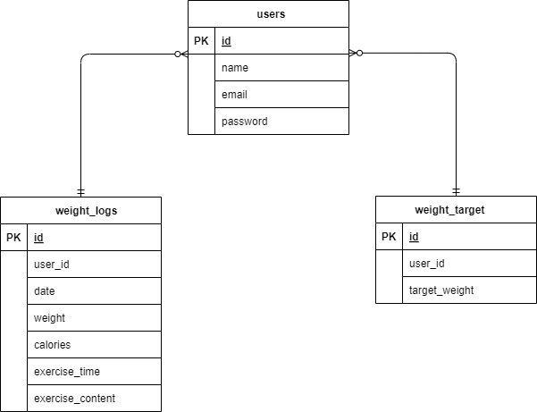

# PIGLy
## 環境設定
### 1.Docker build

```
< $ docker-compose up -d --build >
```
### 2.laravel 設定

・コンテナにログイン → パッケージをインストール

```
< $ docker-compose exec php bash >
< $ composer install >
```
### 3.envファイルのコピー & 設定 

・コンテナにログイン → .envファイルコピー 

```
< $ cp .env.example .env>
```

・.envファイルの設定

  DB_HOST=mysql 
  
  DB_DATABASE=laravel_db  
  
  DB_USERNAME=laravel_user  
  
  DB_PASSWORD=laravel_pass 

### 4.テーブルの作成

```
< $ php artisan migrate >
```

### 5.ダミーデータ作成

```
< $ php artisan db:seed >
```

### 6.アプリケーションキーの作成

```
< $ php artisan key:generate >
```
## 7.シンボリックリンクの作成

```
< $ php artisan storage:link >
```

## URL(view)

ログイン：http://localhost/login

### ログイン (ID・PASSWORD)

ID:demo@icloud.com

PW:kamisama

## 補足事項

###権限エラー

```
< $ chmod -R 777 src/* >
```

## ER図テーブル


